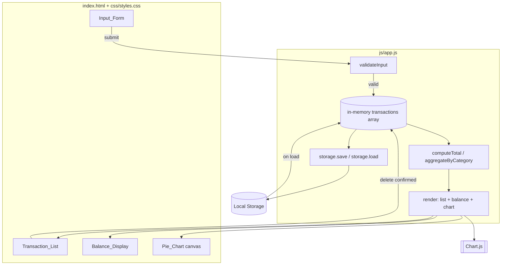
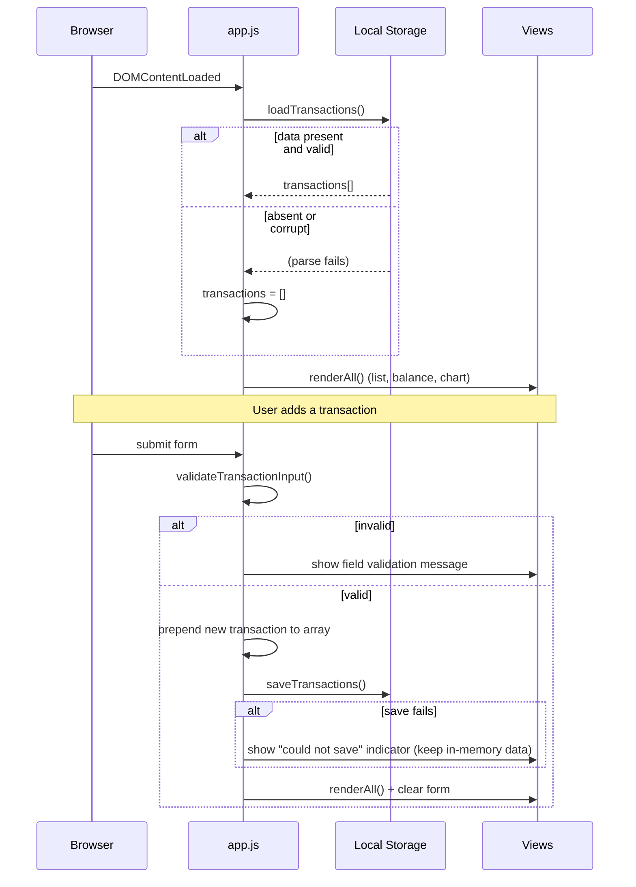

# Design Document

## Overview

The Expense & Budget Visualizer is a fully client-side web application. It records expense transactions, shows them in a scrollable list, tracks a running total balance, and visualizes spending distribution by category as a pie chart. There is no backend: all state lives in the browser and is persisted through the Local Storage API, so the app works offline and can be shipped either as a standalone web page or bundled as a browser extension.

The application is intentionally small and framework-free. It is built from three files:

- `index.html` — structure and markup
- `css/styles.css` — the single stylesheet
- `js/app.js` — the single behavior file (vanilla JavaScript, no framework)

The only third-party dependency is a lightweight charting library ([Chart.js](https://www.chartjs.org/)) used to render the pie chart. Chart.js is loaded from a CDN (with a vendored fallback option for the extension packaging) and does not count against the "one JS file" rule, which applies to the application's own code.

### Design Goals

- **Simplicity**: plain HTML/CSS/JS, readable and easy to follow. No build step required.
- **Single source of truth**: an in-memory array of transactions drives every view (list, balance, chart). Local Storage is a persistence mirror of that array.
- **Resilience**: corrupt or missing storage never crashes the app; failed writes never lose in-memory data.
- **Responsiveness**: all UI updates after an add/delete complete well within the 200 ms budget for typical data sizes.

### Technology Decisions and Rationale

| Decision | Choice | Rationale |
|---|---|---|
| UI layer | HTML + CSS + vanilla JS | User constraint; no framework overhead, minimal payload, fast load. |
| Persistence | Local Storage API | User constraint; synchronous key/value store, no server, survives reloads. |
| Charting | Chart.js | Simple, well-documented pie chart support; avoids hand-rolling SVG/canvas math. |
| Code layout | one CSS file, one app JS file | User constraint (`css/`, `js/` each hold exactly one file). |
| Numeric handling | integer cents internally | Avoids floating-point rounding drift when summing amounts. |

## Architecture

The application follows a simple unidirectional flow. User actions mutate a single in-memory `transactions` array, that array is persisted to Local Storage, and then all three views are re-rendered from the same array. There is no partial/incremental view update logic to keep in sync — every mutation triggers a full render from state, which keeps the code predictable.



### Module Structure (within `js/app.js`)

Although everything lives in one file, the code is organized into clear logical sections:

1. **Constants & config** — category list, limits (`MAX_NAME_LEN = 50`, `MAX_AMOUNT = 999999999.99`, `BALANCE_MIN/MAX`, `MAX_TRANSACTIONS = 10000`, storage key).
2. **State** — the `transactions` array (source of truth) and the last valid rendered balance.
3. **Storage layer** — `loadTransactions()`, `saveTransactions()` wrapping Local Storage with error handling.
4. **Domain logic** (pure functions) — `validateTransactionInput()`, `createTransaction()`, `computeTotal()`, `aggregateByCategory()`, currency/name formatting.
5. **Rendering** — `renderList()`, `renderBalance()`, `renderChart()`, `renderAll()`.
6. **Event wiring** — form submit handler, delete handler (event delegation on the list), and `init()` on `DOMContentLoaded`.

### Application Lifecycle



## Components and Interfaces

### DOM Layout (`index.html`)

The page presents components in the required top-to-bottom order: Balance_Display first, then Input_Form, then Transaction_List, then Pie_Chart.

```
<header> Balance_Display  → #balance, #balance-warning
<section> Input_Form      → #tx-form with #name, #amount, #category, field error nodes
<section> Transaction_List→ #tx-list (scrollable), #empty-state, #list-error
<section> Pie_Chart       → <canvas id="pie">, #chart-empty message
```

### JavaScript Interfaces (conceptual signatures within `js/app.js`)

```js
// ----- Storage layer -----
// Returns a valid Transaction[]; returns [] if storage is absent/corrupt (never throws).
function loadTransactions(): Transaction[]

// Writes transactions to storage. Returns true on success, false on failure (never throws).
function saveTransactions(transactions: Transaction[]): boolean

// ----- Domain logic (pure) -----
// Validates raw form input. Returns { ok: true, value: {name, amountCents, category} }
// or { ok: false, errors: { name?, amount?, category? } }.
function validateTransactionInput(raw: { name, amount, category }): ValidationResult

// Builds a Transaction from validated fields (assigns id + createdAt).
function createTransaction(fields): Transaction

// Sum of all amountCents. Returns { cents, exceededRange: boolean }.
function computeTotal(transactions: Transaction[]): { cents, exceededRange }

// Groups amounts by category, dropping categories that sum to zero.
function aggregateByCategory(transactions: Transaction[]): { [category]: cents }

// ----- Formatting -----
function formatCurrency(cents: number): string   // e.g. 1234 -> "12.34"
function truncateName(name: string): string      // <= 50 chars

// ----- Rendering -----
function renderList(transactions): void
function renderBalance(transactions): void
function renderChart(transactions): void
function renderAll(transactions): void

// ----- Events -----
function handleSubmit(event): void
function handleDelete(transactionId): void
function init(): void
```

### Interaction Contracts

- **Add**: `handleSubmit` validates → on success prepends to array (newest first), calls `saveTransactions`, then `renderAll` and clears the form. On validation failure it shows a per-field message and does not mutate state.
- **Delete**: delete control triggers a native `confirm()` prompt. On confirm, the transaction is removed from the array, persisted, and views re-render. On cancel, nothing changes. If the removal/persist step fails, the transaction is restored and a list error indication is shown.
- **Render from state**: `renderAll` is the only path that writes to the DOM views, always driven by the current array, guaranteeing list, balance, and chart stay consistent.

## Data Models

### Transaction

The core entity. Amounts are stored internally as **integer cents** to avoid floating-point drift; formatting converts to a 2-decimal string for display.

```js
/**
 * @typedef {Object} Transaction
 * @property {string} id          - Unique id (e.g. crypto.randomUUID() or timestamp+random).
 * @property {string} name        - Item name, 1–50 chars, >=1 non-whitespace char.
 * @property {number} amountCents - Positive integer; amount * 100. Max 99,999,999,999 cents.
 * @property {"Food"|"Transport"|"Fun"} category
 * @property {number} createdAt   - Epoch ms; used for newest-first ordering.
 */
```

### Persisted Shape (Local Storage)

Local Storage stores strings only. The transactions array is serialized as JSON under a single key.

```
Key:   "ebv.transactions.v1"
Value: JSON string of an array of Transaction objects
```

Example:

```json
[
  { "id": "a1", "name": "Lunch", "amountCents": 1250, "category": "Food", "createdAt": 1717000000000 },
  { "id": "b2", "name": "Bus fare", "amountCents": 300, "category": "Transport", "createdAt": 1716999990000 }
]
```

A versioned key (`v1`) allows future schema migrations without misreading old data.

### Validation Rules (from Requirements 1.4–1.6)

| Field | Rule | On failure |
|---|---|---|
| name | trimmed length ≥ 1 (has non-whitespace) and raw length ≤ 50 | reject, message on name field |
| amount | parses as a number, `> 0`, `≤ 999,999,999.99`, ≤ 2 decimal places | reject, message on amount field |
| category | one of `"Food"`, `"Transport"`, `"Fun"` (a value is selected) | reject, message on category field |

Amount is validated on its string form (to catch >2 decimal places) before conversion to integer cents.

### Derived Values

- **Total_Balance** = `sum(amountCents) / 100`, rounded to 2 decimals, constrained to `[-999,999,999.99, 999,999,999.99]`. Since amounts are always positive, the total is non-negative; the lower bound and out-of-range handling exist to satisfy the constraint and guard the upper bound.
- **Category aggregation** = map of category → summed cents, excluding any category summing to zero (Requirement 5.2).

## Correctness Properties

*A property is a characteristic or behavior that should hold true across all valid executions of a system — essentially, a formal statement about what the system should do. Properties serve as the bridge between human-readable specifications and machine-verifiable correctness guarantees.*

The application's pure logic — input validation, transaction creation, total computation, category aggregation, rendering formatting, and Local Storage serialization — is well suited to property-based testing. Timing, layout, and infrastructure criteria are handled separately (see Testing Strategy). The properties below are derived from the prework analysis and consolidated to remove redundancy.

### Property 1: Valid input creates a matching transaction and grows the list

*For any* item name with at least one non-whitespace character and length ≤ 50, any amount that is a number greater than 0, at most 999,999,999.99, and with at most 2 decimal places, and any category in {Food, Transport, Fun}, submitting the form SHALL produce a transaction whose name, amount (as integer cents), and category equal the submitted values, and SHALL increase the transaction count by exactly one.

**Validates: Requirements 1.2**

### Property 2: Invalid item names are rejected without changing state

*For any* item name that is entirely whitespace or exceeds 50 characters, submission SHALL be rejected with a validation error identifying the item name field, and the set of transactions SHALL remain unchanged.

**Validates: Requirements 1.4**

### Property 3: Invalid amounts are rejected without changing state

*For any* amount that is empty, non-numeric, less than or equal to 0, greater than 999,999,999.99, or has more than 2 decimal places, submission SHALL be rejected with a validation error identifying the amount field, and the set of transactions SHALL remain unchanged.

**Validates: Requirements 1.5**

### Property 4: Rendered transactions are truncated and currency-formatted

*For any* set of transactions, each rendered row SHALL display the item name truncated to at most 50 characters and the amount formatted as a currency value with exactly two decimal places.

**Validates: Requirements 2.5**

### Property 5: Rendered list is ordered newest-first

*For any* set of transactions with distinct creation times, the rendered order SHALL be strictly descending by creation time (most recently added first).

**Validates: Requirements 2.6**

### Property 6: Total balance equals the sum of amounts

*For any* set of transactions, the displayed Total_Balance SHALL equal the sum of all transaction amounts (computed in integer cents) formatted to two decimal places.

**Validates: Requirements 4.1**

### Property 7: Deleting a transaction removes it and recomputes derived values

*For any* set of transactions and any transaction selected for deletion (confirmed), after deletion that transaction SHALL be absent from both the transaction set and the rendered list, and the Total_Balance and category aggregation SHALL equal the values computed from the remaining transactions.

**Validates: Requirements 3.2, 3.5**

### Property 8: Cancelling deletion leaves the set unchanged

*For any* set of transactions, activating a delete control and then cancelling the confirmation SHALL leave the set of transactions unchanged.

**Validates: Requirements 3.4**

### Property 9: Category aggregation is correct and excludes empty categories

*For any* set of transactions, the pie chart's segment values SHALL equal the summed amounts of the transactions in each category, and no category whose summed amount is zero SHALL appear as a segment.

**Validates: Requirements 5.1, 5.2**

### Property 10: Save then load is a round-trip identity

*For any* set of at most 10,000 valid transactions, writing the set to Storage and then reading it back SHALL yield a set equivalent to the original, with every transaction preserved without loss or truncation.

**Validates: Requirements 6.3, 6.6**

### Property 11: Loading absent or corrupt storage yields an empty set

*For any* stored value that is absent or cannot be interpreted as a set of transactions, loading SHALL return an empty set of transactions and SHALL NOT throw.

**Validates: Requirements 6.4**

### Property 12: Out-of-range totals retain the last valid balance

*For any* set of transactions whose summed amount would fall outside the range -999,999,999.99 to 999,999,999.99, the computation SHALL report that the range was exceeded, and the Balance_Display SHALL retain the last valid Total_Balance rather than showing the out-of-range value.

**Validates: Requirements 4.5**

## Error Handling

The application is defensive at every boundary. No error path is allowed to crash the app or silently lose the user's in-memory data.

### Load errors (Requirement 6.4)

`loadTransactions()` reads the storage key and attempts to `JSON.parse` it. It wraps the whole operation in a try/catch and additionally validates the parsed shape (must be an array of objects with the expected fields and a valid category). On any of the following it returns `[]`:

- key is absent (`null`)
- value is not valid JSON
- parsed value is not an array
- any element fails shape/type validation

The app then renders the empty state for list, balance (`0.00`), and chart. The corrupt value is left in place (not overwritten) unless the user performs a new write, so no data is destroyed on load.

### Save errors (Requirements 6.5, 3.6)

`saveTransactions()` wraps `localStorage.setItem` in try/catch to handle quota-exceeded errors, disabled storage, or private-mode restrictions. It returns `false` on failure. Callers react as follows:

- **On add**: the transaction is already in the in-memory array; if the save returns `false`, the app keeps the in-memory data, re-renders (so the user still sees their transaction), and shows a visible "could not save" indicator. Data is retained in memory for the session.
- **On delete**: deletion is applied to a working copy; the array is only committed if the save succeeds. If save returns `false`, the app restores the transaction, re-renders, and shows a list-level error indication that the deletion did not complete (Requirement 3.6).

### Out-of-range balance (Requirement 4.5)

`computeTotal()` returns `{ cents, exceededRange }`. If the summed value falls outside the allowed range, `renderBalance()` keeps displaying the last valid balance (tracked in state) and shows a range-exceeded indication instead of rendering the invalid figure. Because amounts are always positive and individually capped, this primarily guards the upper bound and any accumulated overflow.

### Validation errors (Requirements 1.4–1.6)

`validateTransactionInput()` returns a structured result with per-field errors. `handleSubmit` renders the message next to the offending field(s) and aborts without mutating state. Fields are re-validated on each submit.

### Error surfaces

| Condition | User-visible surface | Data effect |
|---|---|---|
| Invalid form field | Inline message beside the field | None (submission rejected) |
| Corrupt/absent storage on load | Empty state across all views | Starts empty; stored value untouched |
| Save fails on add | "Could not save" banner/indicator | Kept in memory |
| Save fails on delete | List error indication | Transaction restored |
| Balance out of range | Range-exceeded indication | Last valid balance retained |

## Testing Strategy

The user specified that no test setup is required for delivery, and the app has no build step. This section therefore documents the intended verification approach so the design remains checkable, while keeping the shipped project to `index.html`, one CSS file, and one JS file. Automated tests are optional and, if added, live outside the app's `css/` and `js/` folders so the one-file-per-folder rule is preserved.

### Testing Approach

The design uses a **dual approach**: property-based tests for universal logic properties and example/integration checks for specific scenarios, timing, and layout.

**If property-based testing is adopted**, use an existing library for the target language ([fast-check](https://github.com/dubzzz/fast-check) for JavaScript) rather than hand-rolling generators. Each of the 12 correctness properties maps to a single property test configured to run a **minimum of 100 iterations**. Each test is tagged with a comment in the form:

```
// Feature: expense-budget-visualizer, Property {number}: {property_text}
```

To keep the domain logic testable in isolation, the pure functions (`validateTransactionInput`, `createTransaction`, `computeTotal`, `aggregateByCategory`, `loadTransactions`/`saveTransactions` given an injectable storage, formatting helpers) are written so they can be exercised without a live DOM.

### Property Test Mapping

| Property | Function(s) exercised | Generator focus |
|---|---|---|
| P1 | validateTransactionInput, createTransaction | valid name/amount/category triples |
| P2 | validateTransactionInput | whitespace-only and >50-char names |
| P3 | validateTransactionInput | empty, non-numeric, ≤0, >max, >2-decimal amounts |
| P4 | truncateName, formatCurrency, renderList | long names, arbitrary cent values |
| P5 | renderList | transactions with distinct createdAt |
| P6 | computeTotal, formatCurrency | arbitrary transaction sets |
| P7 | delete flow, computeTotal, aggregateByCategory | set + random target id |
| P8 | delete flow (confirm=false) | arbitrary sets |
| P9 | aggregateByCategory | sets omitting some categories |
| P10 | saveTransactions + loadTransactions | sets up to 10,000 transactions |
| P11 | loadTransactions | garbage strings, invalid JSON, wrong shapes |
| P12 | computeTotal, renderBalance | sets summing beyond the max range |

### Example and Integration Checks (non-PBT criteria)

- **Example tests**: form renders three configured fields (1.1); form clears after add (1.3); missing category rejected (1.6); empty-state message when no transactions (2.4); delete calls `confirm()` before mutating (3.3); balance shows `0.00` when empty (4.4); chart hidden with no-data message when empty (5.5); save failure on delete retains transaction and shows error (3.6, 6.5).
- **Timing/integration checks (manual)**: updates after add/delete complete within their budgets — 200 ms overall (7.2), 500 ms for balance and storage writes (4.2, 4.3, 6.1, 6.2), 1 s for list and chart (2.3, 3.2, 5.3, 5.4). These are verified by confirming updates are synchronous and comfortably within budget for realistic data sizes.
- **Structural check**: exactly one CSS file in `css/` and one application JS file in `js/` (7.3).
- **Visual/responsive checks (manual)**: top-to-bottom component order, 14px minimum text size, 4.5:1 minimum contrast (7.1); list vertical scrolling when overflowing (2.2); no horizontal scroll or overlap across 320–1920px viewports (7.4).
